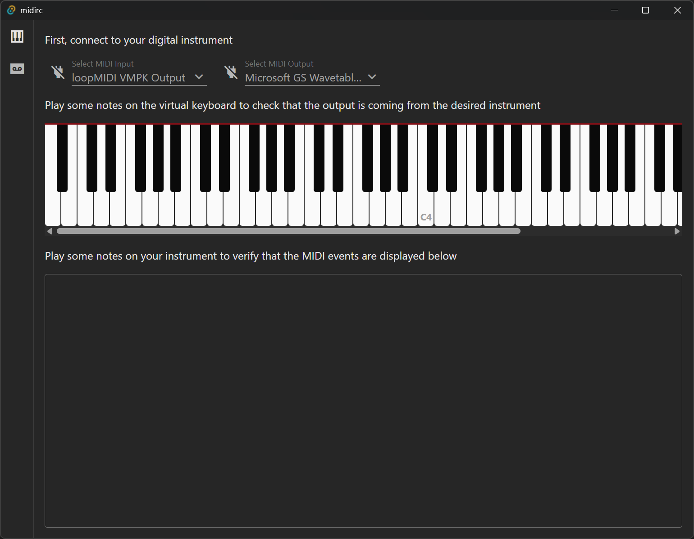
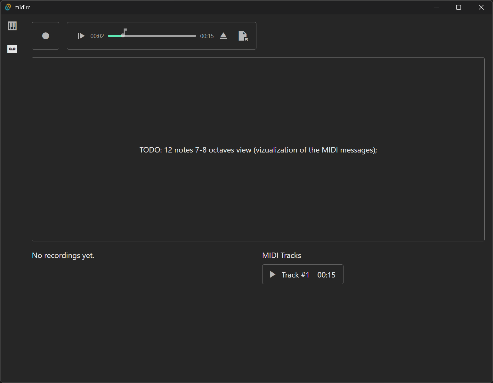

# midirc

Transform your digital instrument experience. With midirc, a powerful Tauri and Rust desktop application, empowering you to connect, record, play back, and interact with your digital piano or any MIDI instrument. Unlock new creative possibilities and enhance your musical journey.

## Roadmap

- [x] Setup instrument connection (input/output)
- [x] WIP: MIDI Recorder
- [x] WIP: MIDI Player (playback)
- [x] WIP: Save/Load Standard MIDI Files (SMF)
- [ ] Interactive Learning Mode (Real-time Feedback & Progression)
  - [ ] Built-in Lessons (e.g. chords, public domain beginner pieces)
- [ ] MIDI Editor (edit and create interactive content)

## Recommended IDE Setup

- [VS Code](https://code.visualstudio.com/) + [Volar](https://marketplace.visualstudio.com/items?itemName=Vue.volar) + [Tauri](https://marketplace.visualstudio.com/items?itemName=tauri-apps.tauri-vscode) + [rust-analyzer](https://marketplace.visualstudio.com/items?itemName=rust-lang.rust-analyzer)

## Type Support For `.vue` Imports in TS

Since TypeScript cannot handle type information for `.vue` imports, they are shimmed to be a generic Vue component type by default. In most cases this is fine if you don't really care about component prop types outside of templates. However, if you wish to get actual prop types in `.vue` imports (for example to get props validation when using manual `h(...)` calls), you can enable Volar's Take Over mode by following these steps:

1. Run `Extensions: Show Built-in Extensions` from VS Code's command palette, look for `TypeScript and JavaScript Language Features`, then right click and select `Disable (Workspace)`. By default, Take Over mode will enable itself if the default TypeScript extension is disabled.
2. Reload the VS Code window by running `Developer: Reload Window` from the command palette.

You can learn more about Take Over mode [here](https://github.com/johnsoncodehk/volar/discussions/471).

## Resources

### MIDI Specifications

- [https://midi.org/specs](https://midi.org/specs)

### MIDI rust lib

- [https://docs.rs/midir/latest/midir/index.html](https://docs.rs/midir/latest/midir/index.html)
- [https://github.com/Boddlnagg/midir/tree/master/examples](https://github.com/Boddlnagg/midir/tree/master/examples)

### Tauri

- [https://tauri.app/develop/](https://tauri.app/develop/)

### Vue

- [https://vuejs.org/guide/introduction.html](https://vuejs.org/guide/introduction.html)

### Google Fonts (Icons)

- [https://fonts.google.com/icons](https://fonts.google.com/icons)

## License

This project is licensed under the [MIT License](./LICENSE).
